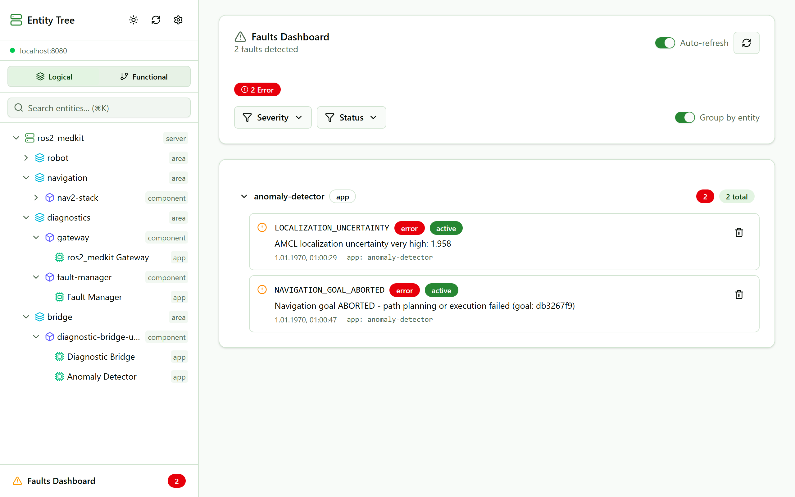

# ros2_medkit

[](https://github.com/selfpatch/ros2_medkit/actions/workflows/ci.yml)
[](https://codecov.io/gh/selfpatch/ros2_medkit)
[](https://selfpatch.github.io/ros2_medkit/)
[](LICENSE)
[](https://docs.ros.org/en/jazzy/)
[](https://discord.gg/6CXPMApAyq)

<p align="center">
  
</p>

<p align="center">
  <b>A diagnostic REST API for ROS 2 robots.</b><br>
  When your robot fails, query <i>what</i> failed and <i>why</i> - remotely, in minutes, without SSH.
</p>

<p align="center">
  Fault lifecycle · Freeze-frame + black-box capture · Live introspection · <a href="https://github.com/selfpatch/ros2_medkit_mcp">AI via MCP</a>
</p>

When a robot breaks in the field you SSH in, run `ros2 node list`, grep logs and try to
reconstruct what happened. That works for one robot on your desk - not for 20 robots at a
customer site, at 2 AM, when you cannot reproduce the issue. ros2_medkit turns your ROS 2
system into a queryable diagnostic surface: structured faults with the state at the moment
of failure, served over a [SOVD](https://www.asam.net/standards/detail/sovd/) REST API that
any tool, dashboard, or agent can reach.

## 5-minute quick start

**Install** (ROS 2 Jazzy, Humble, or Lyrical; Pixi and other options in the
[installation docs](https://selfpatch.github.io/ros2_medkit/installation.html)):

```bash
source /opt/ros/jazzy/setup.bash   # or humble / lyrical
git clone --recurse-submodules https://github.com/selfpatch/ros2_medkit.git
cd ros2_medkit
rosdep install --from-paths src --ignore-src -r -y
colcon build --symlink-install && source install/setup.bash
```

**Run it next to your robot** - one command starts the gateway, the fault manager and the
drop-in fault bridges, with no instrumentation in your nodes:

```bash
ros2 launch ros2_medkit_gateway bringup.launch.py
# REST API on http://localhost:8080/api/v1/
```

**See a fault.** A node logging an `ERROR`, or an action goal aborting, already becomes a
fault via the bridges. To force one now:

```bash
ros2 service call /fault_manager/report_fault ros2_medkit_msgs/srv/ReportFault \
  "{fault_code: 'DEMO_FAULT', event_type: 0, severity: 2, description: 'hello medkit', source_id: '/your_node'}"

curl http://localhost:8080/api/v1/faults
```

**Verify:** the fault appears - a structured entry with its code, severity, source entity,
status (`CONFIRMED`), and a black-box rosbag captured at the moment of failure. That is the
whole point: a remote, structured, time-traveled fault instead of a log you have to be
SSH'd in to read. For a guided walkthrough with demo nodes, see the
[Getting Started tutorial](https://selfpatch.github.io/ros2_medkit/getting_started.html).

## vs. standard ROS 2 diagnostics

`diagnostic_updater` + `/diagnostics` + `diagnostic_aggregator` + `rqt_robot_monitor` report
current node health to a desktop GUI. ros2_medkit turns that into a queryable, remote,
time-traveled, actionable fault - and it **consumes `/diagnostics` too**, so it is additive,
not a rip-and-replace.

| | ROS 2 diagnostics | ros2_medkit |
|---|---|---|
| Access | `/diagnostics` topic + rqt GUI (local desktop) | SOVD REST API (remote; any tool / dashboard / agent) |
| Instrumentation | required (`diagnostic_updater` in node code) | works without it - drop-in bridges (`/rosout`, action status, `/diagnostics` passthrough) |
| State | live OK / WARN / ERROR / STALE | fault lifecycle (debounce, confirm, heal) |
| Moment of failure | none | freeze-frame snapshot + black-box rosbag |
| History | none (live only) | persisted, queryable |
| Model | key/value pairs | structured fault codes + SOVD entity model |
| Scope | ROS only | ROS today; PLC / ECU on one API |
| Agent access | none | MCP adapter |

## Beyond faults

Faults are the front door; the same REST surface exposes the whole ROS 2 graph - discovery
(nodes, topics, services, actions), live topic data, service/action calls with execution
tracking, parameters, bulk data (calibration, firmware, rosbags), SSE subscriptions,
triggers, locking, scripts, software updates and JWT/RBAC auth. The OpenAPI 3.1.0 spec and
Swagger UI live at `/api/v1/docs`. It models your robot as a SOVD **entity tree** (areas ->
components -> apps, with cross-cutting functions) so the same concepts work across robots,
vehicles and embedded systems.

See the [full documentation](https://selfpatch.github.io/ros2_medkit/) for the API reference,
the entity model, per-package guides, and the [roadmap](https://selfpatch.github.io/ros2_medkit/roadmap.html).

## Documentation & community

- 📖 [Documentation](https://selfpatch.github.io/ros2_medkit/) · 🗺️ [Roadmap](https://selfpatch.github.io/ros2_medkit/roadmap.html) · 🧩 [Postman collection](postman/)
- 💬 [Discord](https://discord.gg/6CXPMApAyq) · 🐛 [Issues](https://github.com/selfpatch/ros2_medkit/issues) · 💡 [Discussions](https://github.com/selfpatch/ros2_medkit/discussions)
- 🤝 Contributing: see [CONTRIBUTING.md](CONTRIBUTING.md) and [good first issues](https://github.com/selfpatch/ros2_medkit/labels/good%20first%20issue)
- 🔒 Security: responsible disclosure in [SECURITY.md](SECURITY.md)

## License

Apache License 2.0 - see [LICENSE](LICENSE).

---

<p align="center">
  Made with ❤️ by the <a href="https://github.com/selfpatch">selfpatch</a> community ·
  <a href="https://discord.gg/6CXPMApAyq">Join us on Discord</a>
</p>
